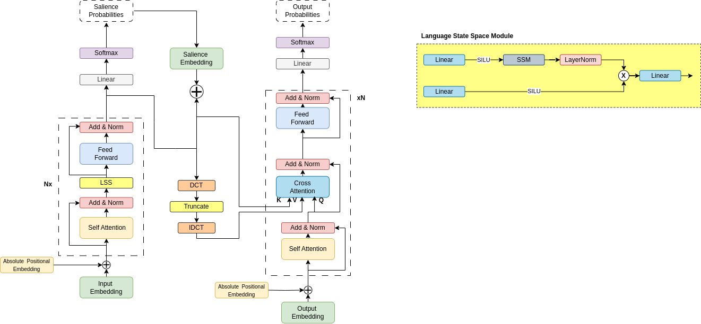

# Lay Summarization with SummerNet on ELIFE AND PLOS Dataset


## Quick Links
  - [Environment](#environment)
  - [Data Preprocessing](#data-preprocessing)
  - [Train](#train)
  - [Inference](#inference)


<div align='center'>
    

    
</div>

## Environment

Create the environment with conda and pip. 
```shell
conda env create -f environment.yml
conda activate season
pip install -r requirements.txt
```
Install nltk "punkt" package.
```shell
python -c "import nltk; nltk.download('punkt');"
```
We've tested this environment with python 3.8 and cuda 10.2. (For other CUDA version, please install the corresponding packages)

## Data Preprocessing
Run the following commands to download the CNN/DM dataset, preprocess it, and save it locally.
```shell
mkdir data
```
- For ELIFE dataset
```shell
python preprocess.py --dataset elife
```

- For PLOS dataset
```shell
python preprocess.py --dataset elife
```

## Train
Please run the scripts below:
```shell
bash run_train.sh
```
The trained model parameters and training logs are saved in `outputs/train` folder.

## Inference
You can use our trained model weights to generate summaries for your data.

```bash
mkdir checkpoints
cd checkpoints
```

Step 2. Generate summaries for CNN/DM Test set.
```bash
bash run_inference.sh
```
After running the script, you will get the results in `outputs/inference` folder including the predicted summaries in `generated_predictions.txt` and the ROUGE results in `predict_results.json`.

## Inference

- We thank the authors of [Season](https://github.com/tencent-ailab/season) their open-source codes.